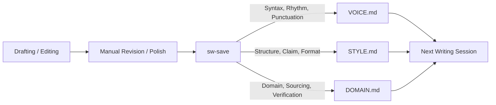

# Compound Writing Architecture

This document describes the architectural principles, context inheritance, and feedback mechanics of the Divings by Sangam Compound Writing plugin.

---

## 1. Design Principles

1. **Context Before Craft**: Load identity, preferences, editorial standards, and source verification rules before invoking any writing workflow.
2. **Authority Before Accumulation**: Prefer maintained source-of-truth files (`VOICE.md`, `STYLE.md`, `DOMAIN.md`) over speculative agent memory or generic defaults.
3. **Outcome Routing**: Route requests by authorial outcome (e.g. "mine memory", "stress-test argument", "scrub AI residue") rather than a rigid linear pipeline.
4. **Human Ownership & Pangram Safety**: Preserve the author's voice and authorship provenance. Substack drafts default to scaffolds because synthetic full drafts flag detector models and erode personal voice.
5. **Durable Artifacts**: Store notes, interview transcripts, scaffolds, and revisions in predictable locations (`context/drafts/<piece-slug>/`).
6. **Progressive Disclosure**: Load only the specific skill instructions and references needed for the active step.

---

## 2. Context Separation of Concerns

```
context/
├── VOICE.md                    # HOW it sounds: diction, rhythm, punctuation, signature moves
├── STYLE.md                    # WHAT it accomplishes: 2 modes, 1 claim, scaffolding, Substack, LinkedIn
├── DOMAIN.md                   # TRUTH standards: Salesforce release PDF truth, scratch org limits
└── references/
    ├── banned_lexicon.csv      # Banned vocabulary and sentence openers
    └── context-contract.md     # Loading priority and rules of engagement
```

- **`VOICE.md`** owns syntax, sentence length variance, mandatory contractions, zero em dashes, and anti-AI tell purges.
- **`STYLE.md`** owns argument structure, falsifiable claim standards, the 6-beat long-form story arc, 4-part short-form arc, Koe/Shipper LinkedIn caption format, and carousel rules.
- **`DOMAIN.md`** owns technical verification, Salesforce release note verification, and dev org isolation.

---

## 3. The Compounding Feedback Loop (`sw-save`)



When an agent proposes phrasing that sounds generic or misses a structural beat:
1. Sangam rewrites the sentence or reframes the section.
2. Running `sw-save` compares the change, extracts the underlying editorial rule, and updates the relevant context file.
3. Subsequent sessions immediately inherit the new rule.

---

## 4. Multi-Platform Interoperability

| Environment | Manifest / Location | How it loads |
|---|---|---|
| **Claude Code** | `.claude-plugin/plugin.json` | Exposed natively as `/sw-*` slash commands. |
| **OpenAI Codex** | `.codex-plugin/plugin.json` | Sub-routine skill catalog. |
| **Google Antigravity** | `.agents/skills/` & `.agents/rules/` | Discovered natively as AGY skills and workspace rules. |
| **Cursor / Windsurf** | `AGENTS.md` & `.agents/rules/` | Loaded into agent context automatically. |
